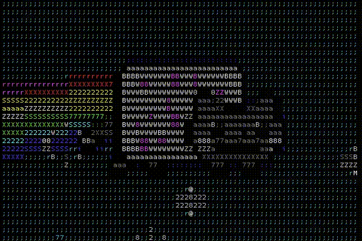
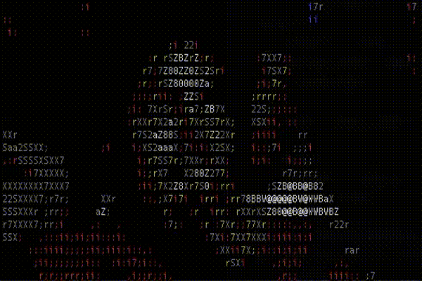

ansi-gif
========

View gifs in your terminal



Currently only supports gifs that use full frame rendering. subframe support coming soon™

Installation
------------

`npm install -g ansi-gif`

Usage
-----

```bash
Usage: ansi-gif [options] <target>

Options:
  --version         Show version number                                [boolean]
  -a, --alphabet    The character set to use when rendering this gif
              [choices: "solid", "variant1", "variant2", "variant3", "variant4",
      "ultra-wide", "wide", "hatching", "bits", "binary", "greyscale", "blocks"]
  -b, --bit-depth   the number of colors to use              [choices: 4, 8, 32]
  -w, --width       the width of the output
  -d, --difference  the color difference algorithm to use in 8bit mode
    [choices: "euclideanDistance", "classic", "ratioDistance", "classicByValue",
             "CIE76Difference", "closestByIntensity", "rankedChannel", "simple",
                                                                     "original"]
  -h, --help        Show help                                          [boolean]

Examples:
  ansi-gif /path/to/my.gif                  render the gif
  ansi-gif  ~/Desktop/nyan.gif -b 4         4bit nyan cat on the desktop
  ansi-gif  ~/Desktop/nyan.gif -a           8bit nyan cat on the desktop
  ultra-wide -w 100 -b 8 -d rankedChannel
  ansi-gif  ~/Desktop/nyan.gif -b 32        32bit nyan cat on the desktop

©2019 - Abbey Hawk Sparrow
```

Examples
--------
try a few of the built in samples like:

`npm run mj-popcorn`



`npm run moon`

`npm run mr-sparkle`

`npm run maxell`

`npm run nyan-cat`

`npm run beetlejuice-caseworker`

`npm run afro-ninja`

`npm run peanuts`

`npm run geometry`

Enjoy,

- Abbey Hawk Sparrow
